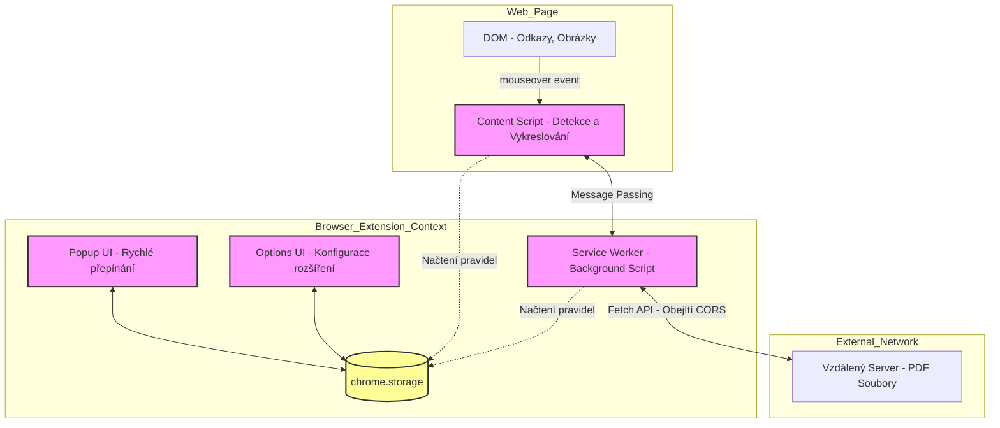

```mermaid
graph TD
    subgraph Web_Page
        DOM[DOM - Odkazy, Obrázky]
        CS[Content Script - Detekce a Vykreslování]
        DOM -->|mouseover event| CS
    end

    subgraph Browser_Extension_Context
        SW[Service Worker - Background Script]
        POP[Popup UI - Rychlé přepínání]
        OPT[Options UI - Konfigurace rozšíření]
        STOR[(chrome.storage)]
        
        CS <-->|Message Passing| SW
        POP <--> STOR
        OPT <--> STOR
        CS -.->|Načtení pravidel| STOR
        SW -.->|Načtení pravidel| STOR
    end

    subgraph External_Network
        PDF_Server[Vzdálený Server - PDF Soubory]
        SW <-->|Fetch API - Obejítí CORS| PDF_Server
    end

    classDef script fill:#f9f,stroke:#333,stroke-width:2px;
    classDef storage fill:#ff9,stroke:#333,stroke-width:2px;
    
    class CS,SW,POP,OPT script;
    class STOR storage;
```
