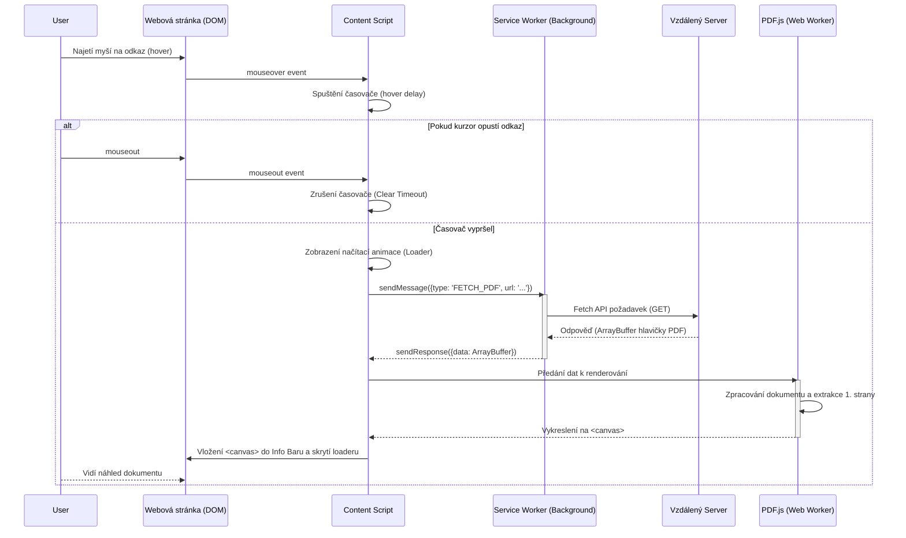

```mermaid
sequenceDiagram
    participant User
    participant DOM as Webová stránka (DOM)
    participant CS as Content Script
    participant SW as Service Worker (Background)
    participant Net as Vzdálený Server
    participant PDF as PDF.js (Web Worker)

    User->>DOM: Najetí myší na odkaz (hover)
    DOM->>CS: mouseover event
    CS->>CS: Spuštění časovače (hover delay)
    
    alt Pokud kurzor opustí odkaz
        User->>DOM: mouseout
        DOM->>CS: mouseout event
        CS->>CS: Zrušení časovače (Clear Timeout)
    else Časovač vypršel
        CS->>CS: Zobrazení načítací animace (Loader)
        CS->>SW: sendMessage({type: 'FETCH_PDF', url: '...'})
        activate SW
        SW->>Net: Fetch API požadavek (GET)
        Net-->>SW: Odpověď (ArrayBuffer hlavičky PDF)
        SW-->>CS: sendResponse({data: ArrayBuffer})
        deactivate SW
        
        CS->>PDF: Předání dat k renderování
        activate PDF
        PDF->>PDF: Zpracování dokumentu a extrakce 1. strany
        PDF-->>CS: Vykreslení na <canvas>
        deactivate PDF
        
        CS->>DOM: Vložení <canvas> do Info Baru a skrytí loaderu
        User-->>DOM: Vidí náhled dokumentu
    end
```
